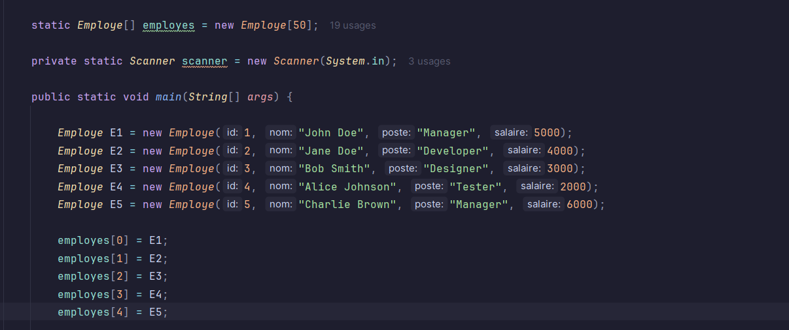
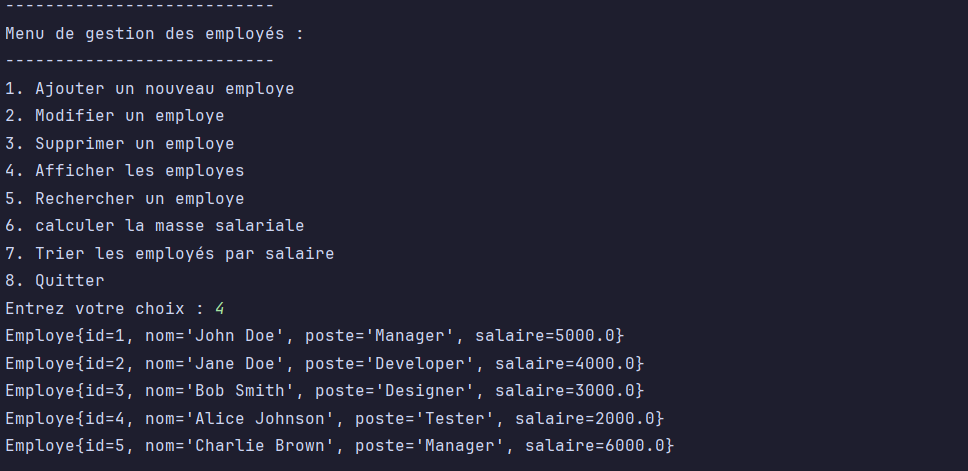
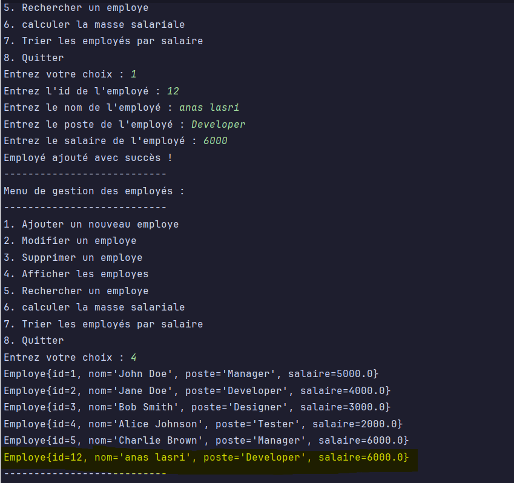
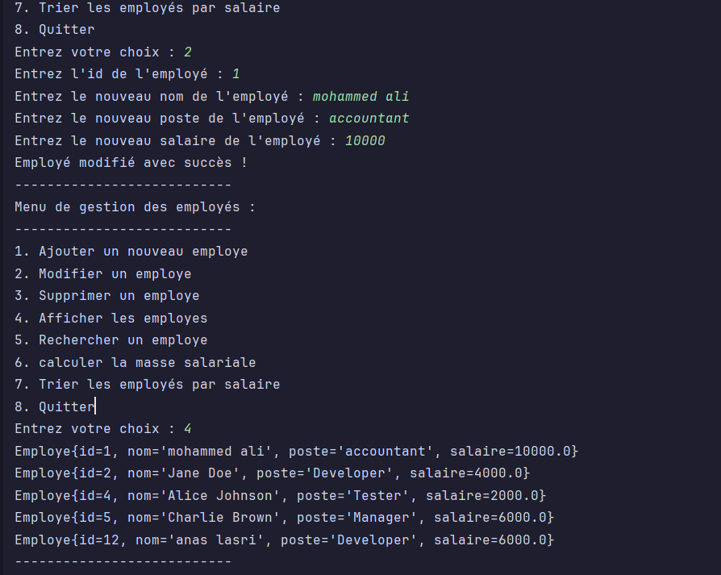
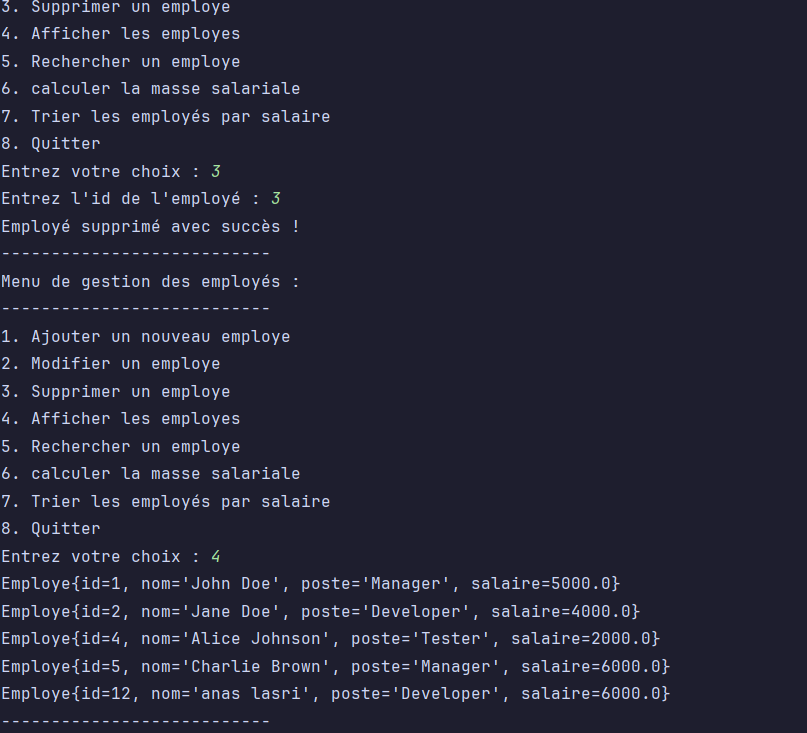
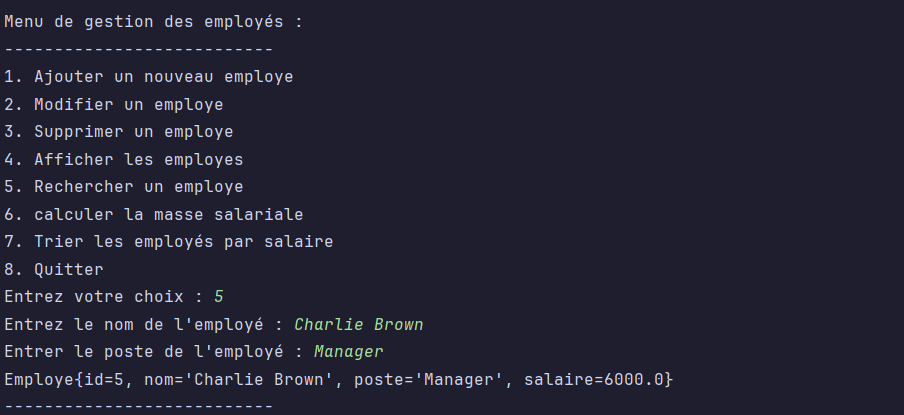
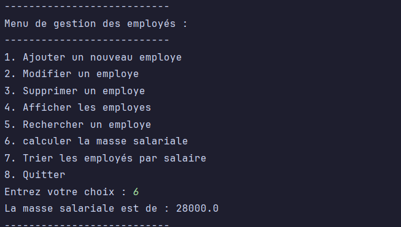
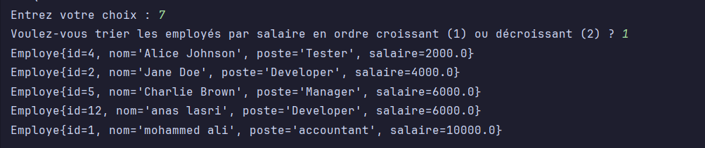
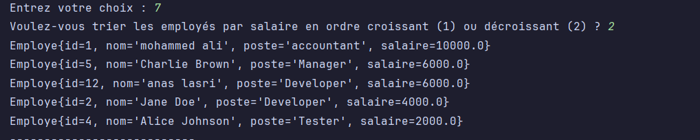
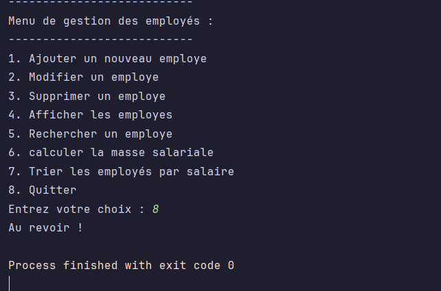

# program usage #

#### we initialize the array with some dummy data. ####

#### we display the menu and let the user choose an option. ####

- we use a switch statement to perform the desired action based on the user's choice. 
- we use a while loop to continue the program until the user chooses to quit.
- here our choice was 4, so we call the `afficherEmployes()` method, and see the objects we initialized above.

#### adding a new employee ####

- we use the `ajouterEmploye()` method to add a new employee to the array.
- as you can see, the employee with id 12 was added.

#### modifying an employee ####

- we use the `modifierEmploye()` method to modify an employee in the array.
- as you can see, the employee with id 1 was modified.
- 

#### deleting an employee ####

- we use the `supprimerEmploye()` method to delete an employee from the array.
- as you can see, the employee with id 3 was deleted.

#### searching for an employee ####

- we use the `rechercherEmploye()` method to search for an employee in the array.
- as you can see, the employee with the name "Charlie Brown" and job description "Manager" was found.

#### calculating the total salary ####

- we use the `calculerMasseSalariale()` method to calculate the total salary of all employees in the array.

#### sorting the employees by salary ####

- we use the `trierParSalaire()` method to sort the employees in the array by salary.
- as you can see, the employees are sorted in descending or ascending order based on their salary.

1. Ascending:

2. Descending:

#### quitting the app ####

- we use the `quitter()` method to exit the program.

#### difficulties ####

- checking for null values before performing each action.
- learning how to sort using Array.stream.sorted because the code looked more elegant.
- 
